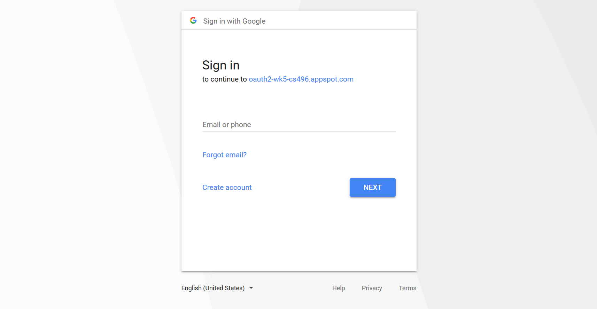
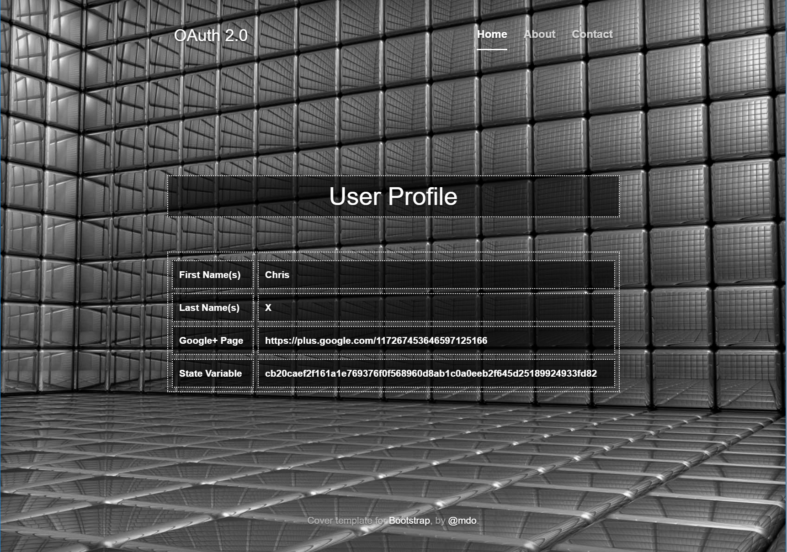

# Using OAuth 2.0

## Overview

[OAuth 2.0](https://oauth.net/) Server Side flow is implemented to access a user's Google+ account and echoe back proof of the authorization.

## Link to Assignment

[OAuth](https://oauth2-wk5-cs496.appspot.com)

## Example

## Improvements
- Do something actually useful after authorization...